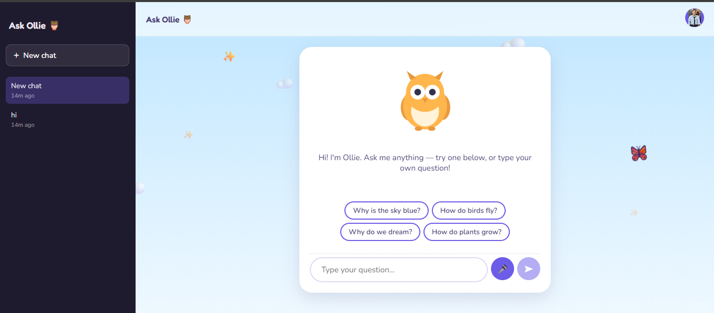

# 🦉 Ask Ollie

**A friendly owl chatbot that answers kids' curious questions in simple, safe, age-appropriate language.**

[**🔗 Live Demo**](https://ask-olie.vercel.app) · [Report a Bug](https://github.com/tawakuliKH/Ask-Ollie/issues) · [Request a Feature](https://github.com/tawakuliKH/Ask-Ollie/issues)

 

  

 

---

## Table of Contents

- [About](#about)
- [Why Ask Ollie](#why-ask-ollie)
- [Features](#features)
- [Tech Stack](#tech-stack)
- [Architecture](#architecture)
- [Project Structure](#project-structure)
- [Getting Started](#getting-started)
- [Environment Variables](#environment-variables)
- [API Reference](#api-reference)
- [Deployment](#deployment)
- [Accessibility](#accessibility)
- [Privacy & Child Safety](#privacy--child-safety)
- [SEO](#seo)
- [Roadmap](#roadmap)
- [Contributing](#contributing)
- [License](#license)

---

## About

**Ask Ollie** is a single-page web application that gives children roughly ages 6–12 a safe, encouraging way to ask "why" and "how" questions about the world — and get short, warm, age-appropriate answers back from a friendly animated owl named Ollie.

The project was built with one core design principle above all others: **child safety comes first, at every layer** — from the AI provider chosen, to the system prompt constraining every response, to how (and whether) any data is stored at all.

There's no complicated setup for the end user. No API key to manage, no technical configuration exposed anywhere in the interface — just open the page, sign in (or skip that entirely with Guest Mode), and start asking questions.

## Why Ask Ollie

Most general-purpose AI chatbots aren't built with children in mind — their tone, content boundaries, and interface assume an adult user. Ask Ollie exists to close that gap:

- **Purpose-built system prompt** constrains every response to short, simple, age-appropriate language, and gently redirects away from mature or unsafe topics
- **No dark patterns** — no accounts required to try it, no data harvesting beyond what's needed to function, no ads
- **Designed to be used *with* a grown-up nearby**, not as an unsupervised babysitter — the interface and copy reflect that throughout

## Features

### 💬 Conversational Chat Interface
A clean, single-page chat experience. Kids can type a question and press Enter or tap send, and Ollie responds in a friendly chat bubble. Before the first message, tappable suggestion chips (e.g. *"Why is the sky blue?"*) help kids get started without needing to know what to ask.

### 🦉 Animated Owl Mascot
Ollie is a hand-built SVG character with two animation states:
- **Idle**: a slow, natural blink loop and gentle wing sway
- **Thinking**: faster wing-flapping paired with animated "..." dots while waiting for a response

All animations respect the `prefers-reduced-motion` browser/OS setting, freezing entirely for users who've requested reduced motion.

### 🎤 Voice Input
Kids can ask questions out loud instead of typing, using the browser's native Web Speech API. Tap the microphone button, speak, and watch the words appear live in the input box — reviewed before sending, so nothing gets sent by accident from a mis-transcription. Gracefully hides itself on browsers that don't support speech recognition (e.g. Safari/Firefox) rather than showing a broken button.

### 🔐 Flexible Sign-In
Two ways to start chatting:
- **Sign in with Google** — a quick, familiar one-tap flow using Google Identity Services. No password to create or remember.
- **Guest Mode** — skip sign-in entirely and start chatting immediately. Guest conversations aren't linked to any identity and stay only on the device they were created on.

### 🗂️ Multi-Session Chat History
A ChatGPT-style sidebar keeps track of past conversations:
- **New Chat** button starts a fresh conversation while keeping previous ones intact
- Each past conversation is listed with an auto-generated title (from the first question asked) and a relative timestamp ("3m ago", "2d ago")
- Click any past conversation to reload it instantly
- Delete individual conversations with one click
- History is scoped per signed-in account (or shared across guest sessions on the same device) and **stored entirely in the browser's `localStorage`** — never sent to or stored on a server

### 👤 Profile Menu
A profile avatar in the top corner (showing the user's Google profile photo, or initials as a fallback) opens a dropdown with their name, email, and a sign-out button. Guest users see a clear "Guest / Not signed in" indicator instead.

### 🎨 Distinct, Purposeful Design
- The **sign-in screen** uses a playful, storybook-style design — a bold amber-bordered card, bigger mascot, bouncy typography — designed to feel warm and inviting to a young child on arrival.
- The **main chat interface** uses a cleaner, more app-like layout (sidebar + topbar + chat panel) suited to daily returning use.
- Animated background decorations — drifting clouds, twinkling sparkles, and a fluttering butterfly — bring the sky-themed palette to life without ever interfering with usability (`pointer-events: none`, fully disabled under reduced-motion preferences).

### 📱 Fully Responsive
Works cleanly from phone-width screens up through desktop. The sidebar collapses behind a toggle on small screens rather than breaking the layout.

### ♿ Accessible by Default
- Full keyboard operability — every interactive element is reachable and operable without a mouse
- `aria-label`s on all icon-only buttons (mic, send, sidebar toggle, delete chat, etc.)
- Visible focus states throughout
- Screen-reader-friendly structure; purely decorative elements (background animations) are marked `aria-hidden`

### 🛡️ Safety-First Backend
- The AI provider's API key **never reaches the browser** — it lives only as a server-side environment variable, read inside the serverless function
- Every request is prepended server-side with a fixed, non-editable system prompt constraining tone, content, and topic boundaries — a child (or anyone inspecting network requests) cannot override or remove it
- Response length is capped server-side (`maxOutputTokens`) to keep behavior predictable and cost bounded
- All failure paths return a friendly, non-technical message — a child never sees a raw error, stack trace, or blank screen

## Tech Stack

| Layer | Technology |
|---|---|
| Frontend framework | React 18 |
| Build tool | Vite |
| Styling | Plain CSS with a custom design-token system (CSS custom properties) |
| Fonts | Google Fonts — Fredoka (display/headings), Nunito (body) |
| Backend | Vercel Serverless Function (Node.js) at `/api/chat` |
| AI Provider | [Google Gemini API](https://ai.google.dev) — `gemini-3.1-flash-lite` |
| Authentication | Google Identity Services (Sign In With Google), token verified server-side via `google-auth-library` |
| Voice input | Browser-native Web Speech API (`SpeechRecognition`) |
| Data storage | Browser `localStorage` only — **no backend database** |
| Hosting / CI | GitHub → Vercel, auto-deploy on every push to `main` |
| Secrets | Vercel Environment Variables, never committed to git |

## Architecture